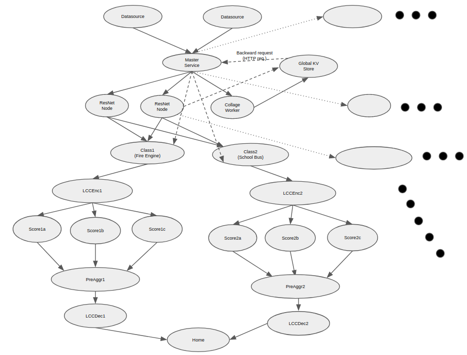

# Classification and Correlation DAG (CCDAG)
A [Jupiter](https://github.com/ANRGUSC/Jupiter) Application

## Application and DAG Illustration

Application details:

 * 500 input images sent at one image per two seconds
 * 5 image types (fire engine, school bus, hyena, whitewolf, tiger)
 * 5 Datasource tasks
 * 9 ResNet tasks
 * 5 Class tasks
 * 5 LCCEnc tasks
 * 15 Score tasks
 * 5 PreAggr tasks
 * 5 LCCDec tasks

## Configuring Jupiter for CCDAG

Clone Jupiter and check out the `ccdag_v1` tag.

    git clone git@github.com:ANRGUSC/Jupiter.git
    git checkout ccdag_v1

Copy all contents of this repository into the `Jupiter/` folder and overwrite any
existing files.

    cp -r ccdag/ Jupiter/

Make any modifications to app_specific_files/config_app.yaml to include the 
hostnames of your cluster. Then, at the top level of `Jupiter/`

    python configure_app.py app_specific_files/ccdag
